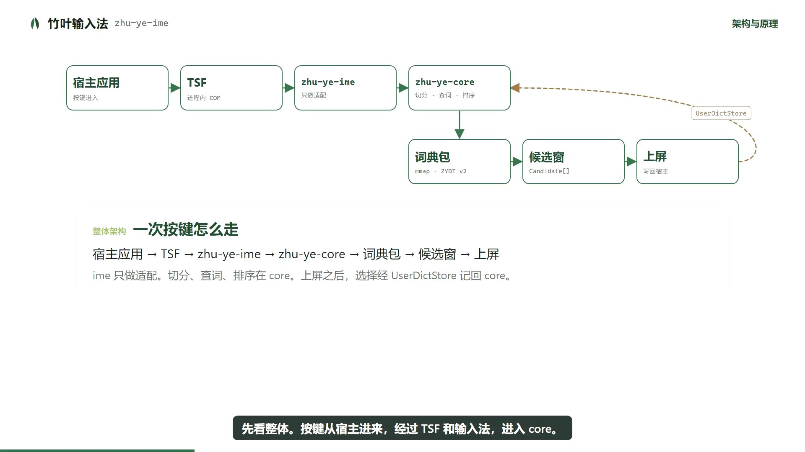
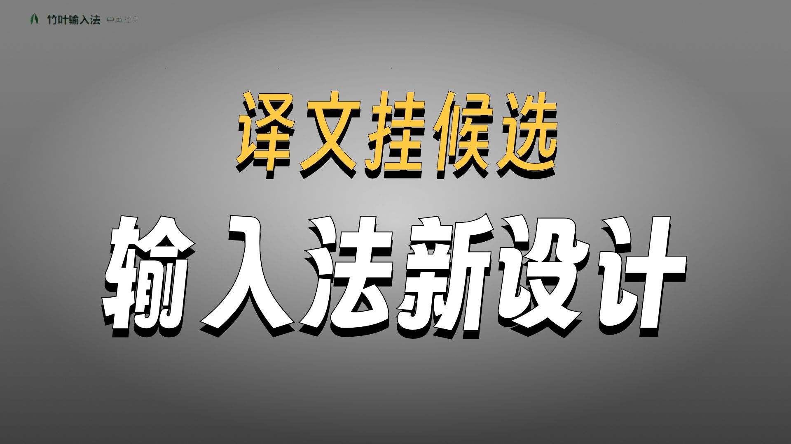
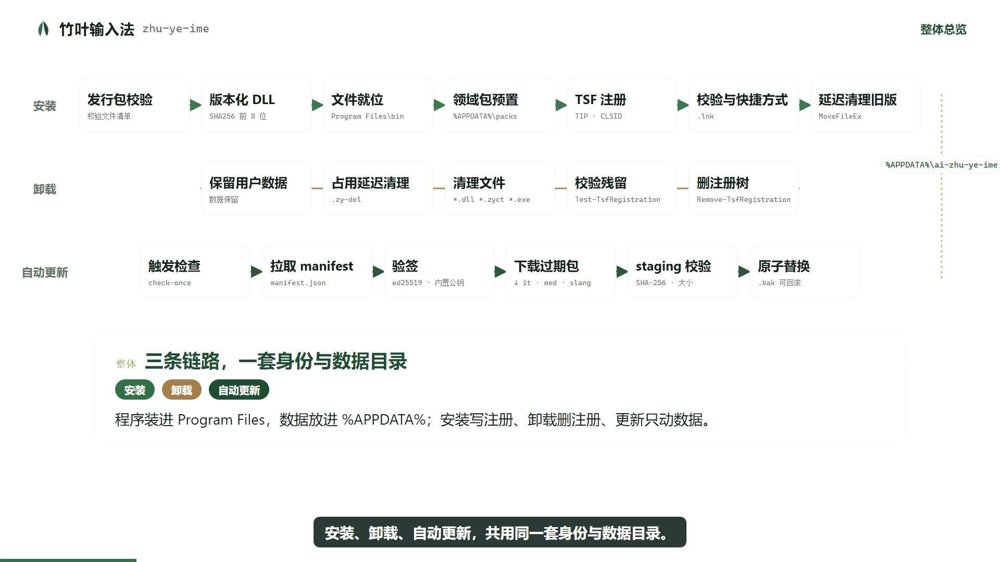
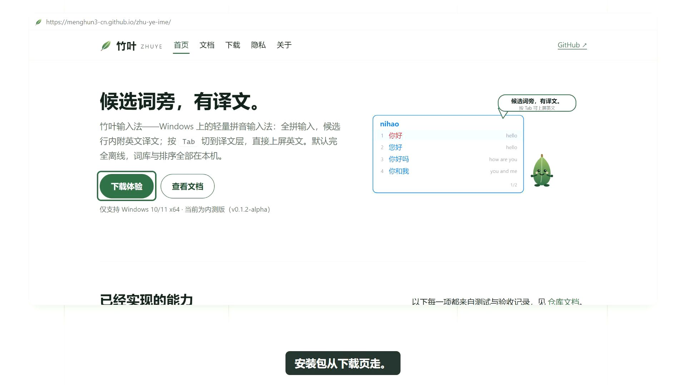

# lsg-remotion-video-sop

用 Remotion + React 做讲解片和宣传片的 SOP 技能。开工前先拷问并给出推荐项，确认分镜之后再渲染。先出无语音成片，成品后再补语音和音效。

## 分类

暂时只有两类。下面的封面来自用这套流程做出的成片，点开到 B 站观看。

### 架构原理知识讲解

调用链、分层、不变量。原理讲解要有原理图；涉及架构时再加架构图。

<table>
  <tr>
    <td width="33%" align="center">
      <a href="https://www.bilibili.com/video/BV1KaHn6tEv1">
        
      </a>
      <br>
      <a href="https://www.bilibili.com/video/BV1KaHn6tEv1">一次按键的架构热路径 · 1:44</a>
    </td>
    <td width="33%" align="center">
      <a href="https://www.bilibili.com/video/BV181HH6qEoU">
        
      </a>
      <br>
      <a href="https://www.bilibili.com/video/BV181HH6qEoU">中英译文原理 · 1:54</a>
    </td>
    <td width="33%" align="center">
      <a href="https://www.bilibili.com/video/BV1xfHW6iEsU">
        
      </a>
      <br>
      <a href="https://www.bilibili.com/video/BV1xfHW6iEsU">安装、卸载与自动更新 · 2:00</a>
    </td>
  </tr>
</table>

### 产品宣传

卖点、主视觉、实机、下载或 CTA。

<table>
  <tr>
    <td width="50%" align="center">
      <a href="https://www.bilibili.com/video/BV1XwHW6yEC4">
        
      </a>
      <br>
      <a href="https://www.bilibili.com/video/BV1XwHW6yEC4">候选词旁，有译文 · 1:16</a>
    </td>
  </tr>
</table>

## 开场与动效

两类片子都从同一组开场起手：logo、吉祥物、品牌名、主标题、副标题。

动效按内容和主题选用，能对上的尽量落到某一镜：卡片、文字、跳动、光效、描边、粒子、卡片渐入、卡片收束为扇形、镜头转场、强调与演示、图形生长。画面上没有对应内容时不硬加。上面四支成片分别用了架构连线、原理图行走、卡片和产品主视觉。

## 流程

1. 选择分类，按 `references/grilling.md` 拷问。
2. 按 `references/confirm.md` 输出时长、分镜、分镜内容、动效、特效、入场、出场、帧、画面、字幕跟随，停下来等确认。
3. 用 Remotion 渲染无语音成片。默认 1920×1080、30fps。
4. 成片验收后补声音。语音和音效优先 ElevenLabs；不可用时语音降级为 Edge TTS。

## 目录

```
SKILL.md
references/
  grilling.md
  confirm.md
  motion.md
  layout.md
  audio.md
assets/
  hotpath.jpg
  translation.jpg
  install.jpg
  promo.jpg
```

## 安装

把本目录放到智能体的技能目录中，使 `SKILL.md` 位于技能根目录。触发词包括 `lsg-remotion-video-sop`、remotion 视频、架构讲解、原理讲解、产品宣传视频。
